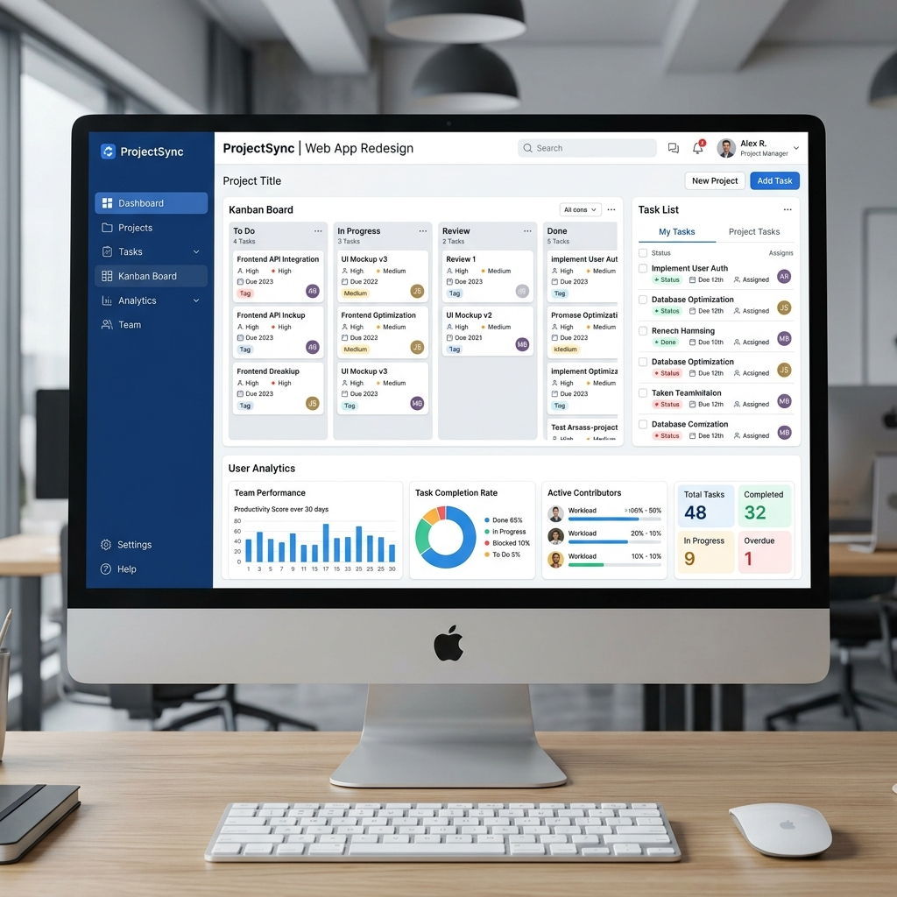

## UI / UX Mockup



# ProjectTrack 

A full-stack Project Tracking System built with **Node.js/Express** (backend) and **React/Vite** (frontend), using **SQLite** for data persistence.

## Quick Start

### Prerequisites

- Node.js v18+ installed
- npm v8+

### Backend

```bash
cd backend
npm install
npm run seed    # Seeds 10 sample projects
npm run dev     # Starts API server at http://localhost:3001
```

### Frontend

```bash
cd frontend
npm install
npm run dev     # Starts dev server at http://localhost:5173
```

> **Note**: The frontend Vite dev server proxies `/api` requests to the backend at `http://localhost:3001`. Make sure the backend is running first.

---

## API Documentation

**Base URL**: `http://localhost:3001/api`

### Project Model

| Field | Type | Required | Description |
|:---|:---|:---|:---|
| `id` | UUID | auto | Unique identifier |
| `name` | string | ✅ | Project name |
| `clientName` | string | ✅ | Client name |
| `status` | string | auto | `active`, `on_hold`, or `completed` |
| `startDate` | ISO 8601 | — | Optional start date |
| `endDate` | ISO 8601 | — | Optional end date (must be ≥ startDate) |
| `createdAt` | ISO 8601 | auto | Record creation timestamp |
| `updatedAt` | ISO 8601 | auto | Last modification timestamp |

### Endpoints

#### `POST /api/projects` — Create a project

```json
// Request body
{
  "name": "My Project",
  "clientName": "Acme Corp",
  "startDate": "2026-03-01",
  "endDate": "2026-06-30"
}

// Response (201)
{ "success": true, "data": { ...project } }
```

> **Validation**: `endDate` must be ≥ `startDate` when both are provided.

#### `GET /api/projects` — List projects (paginated)

| Query Param | Type   | Default      | Description |
|-------------|--------|--------------|-------------|
| `status`    | string | —            | Filter: `active`, `on_hold`, `completed` |
| `search`    | string | —            | Search by project name or client name (case-insensitive) |
| `page`      | int    | 1            | Page number |
| `limit`     | int    | 10           | Items per page (max 100) |
| `sortBy`    | string | `createdAt`  | Sort column: `name`, `clientName`, `status`, `startDate`, `endDate`, `createdAt`, `updatedAt` |
| `order`     | string | `desc`       | `asc` or `desc` |

```json
// Response (200)
{
  "success": true,
  "data": [ ...projects ],
  "pagination": { "page": 1, "limit": 10, "total": 10, "totalPages": 1 }
}
```

#### `GET /api/projects/:id` — Get project details

```json
// Response (200)
{ "success": true, "data": { ...project } }

// Response (404)
{ "success": false, "error": "Project not found" }
```

#### `PUT /api/projects/:id` — Update project fields

Accepts any subset of: `name`, `clientName`, `startDate`, `endDate`.

#### `PATCH /api/projects/:id/status` — Update project status

```json
// Request body
{ "status": "on_hold" }

// Success (200)
{ "success": true, "data": { ...project } }

// Invalid transition (400)
{ "success": false, "error": "Cannot transition from 'completed' to 'active'. Allowed transitions: none (terminal state)" }
```

#### `DELETE /api/projects/:id` — Soft delete a project

```json
// Response (200)
{ "success": true, "message": "Project deleted successfully" }
```

### Status Transition Rules

| Current Status | Allowed Transitions |
|:---|:---|
| `active` | `on_hold`, `completed` |
| `on_hold` | `active`, `completed` |
| `completed` | *(terminal — no transitions)* |

Invalid transitions return `400` with a descriptive error message.

---

## Technical Decisions & Assumptions

### Backend

- **SQLite via `better-sqlite3`**: Zero-config, file-based, synchronous API — ideal for this project scope. WAL mode enabled for better read performance.
- **Soft delete**: Projects are never physically removed. `deletedAt` timestamp is set and records are excluded from queries. This allows future "restore" functionality.
- **UUID primary keys**: Prevents sequential ID enumeration and simplifies future scalability.
- **Input validation**: All endpoints use `express-validator` for request validation with descriptive error messages. `endDate >= startDate` is enforced on the backend to prevent bypass via direct API calls.
- **Status transition enforcement**: Business rules are enforced in the model layer (not the route layer) to prevent bypassing via direct API calls.
- **SQL injection prevention**: All queries use parameterized statements. Sort columns are whitelisted.

### Frontend

- **React + Vite**: Fast development experience with HMR.
- **Axios**: HTTP client with interceptors for consistent error handling.
- **Debounced search**: 350ms debounce on search input prevents excessive API calls.
- **Inline status transitions**: Dropdown shows only valid next statuses per the transition rules — impossible to select invalid transitions.
- **Sort controls**: Dropdown for sort field + toggle button for ascending/descending order.
- **Optimistic loading**: Stats bar shows project counts. All states (loading, empty, error, no results) are handled.
- **No external UI library**: All styling is custom CSS with CSS custom properties for consistent theming.

---

## Project Structure

```
├── backend/
│   ├── src/
│   │   ├── index.js              # Express server entry
│   │   ├── db.js                 # SQLite initialization
│   │   ├── seed.js               # Sample data seeder
│   │   ├── models/project.js     # Data layer with business logic
│   │   ├── routes/projects.js    # API route handlers
│   │   └── middleware/errorHandler.js
│   ├── test-api.js               # API integration tests
│   └── package.json
├── frontend/
│   ├── src/
│   │   ├── App.jsx               # Root component
│   │   ├── main.jsx              # Entry point
│   │   ├── index.css             # Global styles
│   │   ├── api/projects.js       # API service layer
│   │   ├── pages/Dashboard.jsx   # Main dashboard page
│   │   └── components/
│   │       ├── StatusBadge.jsx
│   │       ├── ProjectForm.jsx
│   │       ├── ProjectDetail.jsx
│   │       ├── ConfirmDialog.jsx
│   │       └── Toast.jsx
│   └── package.json
└── README.md
```

---

## AI Tools Used

- **Claude Opus 4.6** — Used to review and verify that the implementation aligns with the assignment requirements.
- **ChatGPT & Gemini** — Used to help clarify and better understand the assignment scope and expectations.

---
